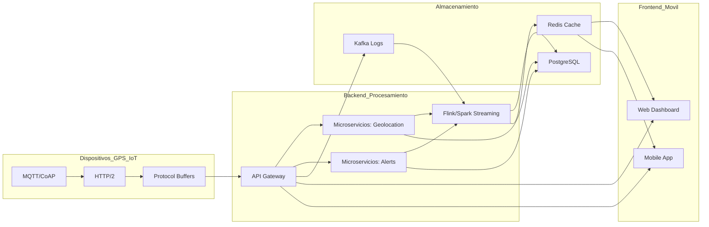
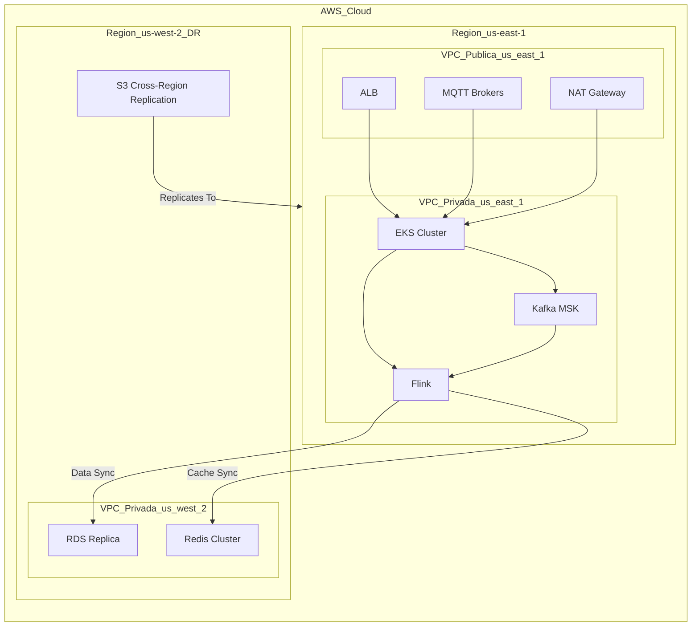
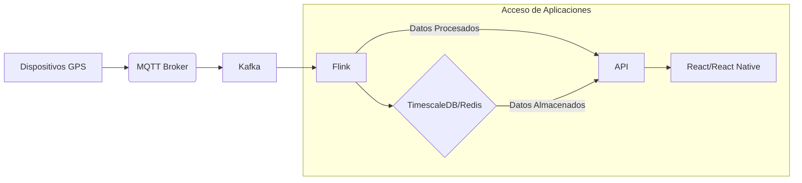

# Arquitectura Detallada para Sistema Web/Móvil con GPS en Tiempo Real

## 1. Diagrama de Componentes

| **Dispositivos** (GPS IoT)      | **Backend** (Procesamiento) | **Almacenamiento** | **Frontend/Móvil** |
|---------------------------------|-----------------------------|--------------------|---------------------|
| - MQTT/CoAP                     | - API Gateway               | - PostgreSQL       | - Web Dashboard     |
| - HTTP/2                        |   (Kong/Traefik)            |   (TimescaleDB)    |   (React + Mapbox)  |
| - Protocol Buffers              | - Microservicios:           | - Redis (Caché)    | - Mobile App        |
|                                 |   * Geolocation             | - Kafka (Logs)     |   (React Native)    |
|                                 |   * Alerts                  |                    |                     |
|                                 | - Flink/Spark (Streaming)   |                    |                     |



Este diagrama muestra cómo los diferentes componentes del sistema AVL se interconectan y colaboran:
* __Dispositivos (GPS IoT)__: Representa los dispositivos que envían datos, utilizando protocolos como MQTT/CoAP, HTTP/2 y Protocol Buffers para la comunicación eficiente.
* __Backend (Procesamiento)__: Esta sección central maneja la lógica de negocio y el procesamiento de datos.
	* La __API Gateway__ actúa como el punto de entrada principal.
	* Los __Microservicios__ (Geolocation, Alerts) se encargan de funciones específicas.
	* __Flink/Spark (Streaming)__ procesa datos en tiempo real.
* __Almacenamiento__: Aquí se gestionan los datos.
	* __PostgreSQL (con TimescaleDB)__ se usa para almacenar datos temporales y series de tiempo.
	* __Redis__ funciona como caché para un acceso rápido a los datos.
	* __Kafka__ se utiliza para gestionar logs y flujos de eventos.
* __Frontend/Móvil__: Permite la interacción del usuario.
	* El __Web Dashboard__ proporciona una interfaz de usuario basada en React y Mapbox para visualizar y gestionarla información.
	* La __Mobile App__ ofrece funcionalidades similares para dispositivos móviles, desarrollada con React Native.


### 1.1. Flujo de Datos

__Dispositivos GPS → MQTT Broker (EMQX/Mosquitto) → Kafka__ (cola de mensajes).

__Procesador en Tiempo Real (Flink)__ consume datos de Kafka → Filtra/Agrega → Almacena en PostgreSQL/Redis.

__API REST/GraphQL__ (Go/Elixir) sirve datos al __Frontend (React)__ y __App Móvil (React Native)__.

__WebSocket__ para actualizaciones en vivo en el mapa.

## 2. Estrategia para 50k → 500k Dispositivos

### 2.1 Escalabilidad Horizontal
* __MQTT Broker Clusterizado__ (EMQX):
	* Balanceo de carga con DNS Round Robin + Session Persistence.
	* Particionamiento por región geográfica (ej: topics gps/us-east, gps/eu-central).
* __Kafka__:
	* Aumento de partitions y consumers (Flink workers autoescalables).
	* Compresión de mensajes (Snappy/Zstandard).
* __API Gateway__:
	* Balanceo de carga con DNS Round Robin.
	* Rate limiting por dispositivo (100 req/s) usando Redis + Token Bucket.
* __Flink__:
	* Autoescalamiento de workers (Flink autoescalamiento).
	* Balanceo de carga con DNS Round Robin.
* __PostgreSQL__:
	* Autoescalamiento de workers (PostgreSQL autoescalamiento).
	* Compresión de datos (pg_bloat).
* __Redis__:
	* Autoescalamiento de workers (Redis autoescalamiento).
	* Compresión de datos (Redis compression).     

### 2.2 Optimización de Recursos
* __Edge Computing__:
	* Preprocesamiento en dispositivos (ej: enviar datos solo si hay movimiento > 50 metros).
* __Protocol Buffers__:
	* Reduce tamaño de payload en un 60% vs JSON.

## 3. Alta Disponibilidad (HA) y Recuperación ante Desastres (DR)

### 3.1 Alta Disponibilidad
* MQTT Broker:
	* Cluster en múltiples AZs con réplica sincrónica (EMQX Enterprise).
* Bases de Datos:
	* PostgreSQL: Streaming replication con 1 líder + 2 réplicas.
	* Redis: Cluster mode con sharding (16 particiones).
* Kubernetes:
	* Distribución de pods en ≥3 nodos (anti-affinity rules).

### 3.2 Disaster Recovery
* Backups Automatizados:
	* PostgreSQL: WAL-G + Snapshots en S3 (retención de 30 días).
	* Kafka: MirrorMaker a región secundaria (AWS us-east → us-west).
* Recuperación:
	* RTO < 15 min: Failover automático con Prometheus + Alertmanager.
	* RPO < 1 min: Replicación asíncrona con lag controlado.

## 4. Tecnologías Clave

| Capa               | Tecnología              | Razón de Elección                              |
|--------------------|-------------------------|------------------------------------------------|
| __Comunicación__   | MQTT + TLS 1.3          | Bajo Overheah, ideal para IoT                  |
| __Procesamiento__  | Apache Flink            | Estado consistente en ventanas de tiempo       |
| __Almacenamiento__ | TimescaleDB             | Escalabilidad para series temporales + PostGIS |
| __Frontend__       | React + Mapbox GL       | Renderizado rápido de mapas complejos          |
| __Movíl__          | React Nativa + Maplibre | Mismo código para iOS/Android                  |


## 5. Diagrama de Despliegue en AWS


**AWS Cloud**

| **Región us-east-1**       | **Región us-east-1** | **Región us-west-2** (DR) | **Región us-west-2** (DR)     |
|----------------------------|----------------------|---------------------------|-------------------------------|
| - VPC Publica:             | - VPC Privada:       | - VPC Privada:            | - S3 Cross-Region Replication |
|   * ALB                    |   * EKS Cluster      |   * RDS Replica           |                               |
|   * MQTT Brokers           |   * Kafka (MSK)      |   * Redis Cluster         |                               |
|   * NAT Gateway            |   * Flink            |                           |                               |




## 6. Mitigación de Cuellos de Botella
Escenario	Solución
Picos de conexiones	MQTT Broker con autoescalado (K8s HPA).
Latencia en consultas	Particionamiento por tiempo en TimescaleDB.
Fallo de región	DNS failover a región secundaria (Route 53).

## 7. Costo-Efectividad
* AWS Savings Plans para recursos estables (ej: RDS, EKS).
* Spot Instances para workers de Flink/Kafka (ahorro del 70%).
* Cold Storage: Archivado de datos históricos en S3 Glacier.

## 8. Conclusión
La arquitectura propuesta garantiza:
- ✅ Escalabilidad horizontal desde 50k hasta 500k dispositivos.
- ✅ Latencia <500ms con Redis + Flink.
- ✅ HA 99.99% mediante multi-AZ y replicación.
- ✅ DR automatizado con RPO/RTO mínimos.

___________________________________________________________________________


# Ventajas de la Arquitectura Propuesta
## 1. Justificación de Microservicios vs Monolito

| Criterio       | Microservicios (Arquitectura Propuesta)                           | Monolito (Alternativa)                          |
|----------------|-------------------------------------------------------------------|------------------------------------------------|
| Escalabilidad  | Escala componentes críticos (ej: procesamiento de GPS) independientemente. | Escala verticalmente (límite de hardware).     |
| Resiliencia    | Fallos aislados (ej: un microservicio de alertas no afecta la geolocalización). | Un fallo puede derribar todo el sistema.       |
| Mantenibilidad | Equipos pueden trabajar en paralelo (DevOps por servicio).        | Acoplamiento alto, cambios riesgosos.          |
| Tecnología     | Flexibilidad para usar lenguajes/BDs óptimos por servicio (Go para APIs, Flink para streaming). | Todo en un solo stack (rígido). |
| Despliegue     | Actualizaciones graduales (canary deployments).                   | Requiere despliegue completo.                  |

### 1.1. Conclusión:
Los microservicios son ideales para sistemas IoT con alta escalabilidad y requisitos de disponibilidad, aunque requieren mayor inversión en orquestación (Kubernetes) y monitoreo.

## 2. Selección de Protocolos para Dispositivos GPS

| Protocolo | Ventajas                                                                 | Casos de Uso                              | Por qué elegirlo                                      |
|-----------|--------------------------------------------------------------------------|-------------------------------------------|------------------------------------------------------|
| **MQTT**  | - Bajo consumo de energía/ancho de banda.<br>- Soporta QoS (0,1,2).<br>- Ideal para redes inestables. | Principal para envío masivo de datos GPS. | Optimizado para IoT; 80% menos tráfico que HTTP.     |
| **CoAP**  | - Ligero como MQTT pero RESTful.<br>- Compatible con HTTP/2.            | Dispositivos con restricciones extremas.  | Alternativa si el dispositivo ya usa HTTP.           |
| **HTTP/2**| - Ubicuo y fácil de debuggear.<br>- Soporte nativo en bibliotecas.      | Configuración/administración de dispositivos. | Solo para APIs de control, no para datos masivos.    |

### 2.1. Elección Final:

MQTT para datos GPS (eficiencia).

HTTP/2 para gestión de dispositivos (compatibilidad).

## 3. Gestión de Colas y Procesamiento en Tiempo Real

| Protocolo | Ventajas                                                                 | Casos de Uso                              | Por qué elegirlo                                      |
|-----------|--------------------------------------------------------------------------|-------------------------------------------|------------------------------------------------------|
| **MQTT**  | - Bajo consumo de energía/ancho de banda<br>- Soporta QoS (0,1,2)<br>- Ideal para redes inestables | Principal para envío masivo de datos GPS  | Optimizado para IoT; 80% menos tráfico que HTTP      |
| **CoAP**  | - Ligero como MQTT pero RESTful<br>- Compatible con HTTP/2               | Dispositivos con restricciones extremas   | Alternativa si el dispositivo ya usa HTTP            |
| **HTTP/2**| - Ubicuo y fácil de debuggear<br>- Soporte nativo en bibliotecas         | Configuración/administración de dispositivos | Solo para APIs de control, no para datos masivos     |

### 3.1. Beneficios:

Kafka: Maneja picos de 500k dispositivos sin pérdida de datos (replicación).

Flink: Detecta anomalías en tiempo real (ej: velocidad excesiva) con ventanas de 5 segundos.

## 4. Almacenamiento y Particionamiento

| Base de Datos               | Estrategia                                                                 | Ventajas                                                                 | Escalabilidad                              |
|-----------------------------|----------------------------------------------------------------------------|--------------------------------------------------------------------------|--------------------------------------------|
| **TimescaleDB** (PostgreSQL) | - Particionamiento por tiempo y geohash<br>- Índices GiST para consultas geoespaciales | - SQL estándar + optimizaciones para series temporales<br>- Soporte PostGIS (distancias, polígonos) | - Escala a TB de datos con particiones    |
| **Redis**                   | - Cache de ubicaciones recientes (TTL: 1h)<br>- Estructuras de datos geoespaciales (GEOADD) | - Latencia sub-milisegundo<br>- Ideal para dashboards en tiempo real      | - Cluster mode con sharding automático     |
| **Kafka** (Logs)            | - Retención de 7 días para reprocesamiento                                | - Recuperación ante fallos (replay de mensajes)                         | - Escala horizontalmente con brokers       |


Estrategias Clave:

* Particionamiento en TimescaleDB:
```sql
CREATE TABLE gps_data (
time TIMESTAMPTZ NOT NULL,
device_id INT,
location GEOGRAPHY(POINT)
) PARTITION BY RANGE (time);
```
* Consultas rápidas como:
```sql
SELECT * FROM gps_data 
WHERE ST_DWithin(location, ST_Point(-74.0, 40.7)::geography, 1000) -- Dispositivos en 1km de NYC
AND time > NOW() - INTERVAL '1 hour';
```

* Redis para Tiempo Real:

    - Almacenamiento con clave: `device:{id}:last_location.`

    - Búsqueda de dispositivos cercanos:
```sql
GEOADD fleet -74.0 40.7 device_123
GEORADIUS fleet -74.0 40.7 10 km
```
### 4.1. Resumen de Ventajas Técnicas

* Microservicios: Escalabilidad granular y resiliencia ante fallos.

* MQTT: Eficiencia en redes limitadas (óptimo para GPS).

* Kafka + Flink: Procesamiento real-time con capacidad de reprocesamiento.

* TimescaleDB + Redis: Consultas geoespaciales rápidas y caché de ultra baja latencia.

### 4.2. Impacto en el Negocio:

* Reducción de costos: Menor ancho de banda (MQTT vs HTTP) + escalabilidad bajo demanda.

* Disponibilidad 99.99%: Multi-AZ + replicación cross-region.

* Experiencia de usuario: Actualizaciones en tiempo real (<500ms) en mapas.



[__Anterior__ Inicio](Readme.md)
[__Siguente__ Stack Tecnólogico](/docs/stack_tecnologico.md)