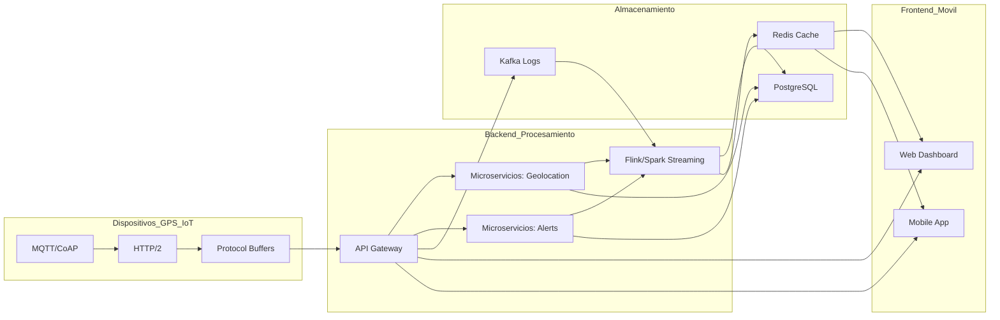

Arquitectura Detallada para Sistema Web/Móvil con GPS en Tiempo Real

# 1. Diagrama de Componentes

Este diagrama muestra cómo los diferentes componentes del sistema AVL se interconectan y colaboran:
* __Dispositivos (GPS IoT)__: Representa los dispositivos que envían datos, utilizando protocolos como MQTT/CoAP, HTTP/2 y Protocol Buffers para la comunicación eficiente.
* __Backend (Procesamiento)__: Esta sección central maneja la lógica de negocio y el procesamiento de datos.
	* La __API Gateway__ actúa como el punto de entrada principal.
	* Los __Microservicios__ (Geolocation, Alerts) se encargan de funciones específicas.
	* __Flink/Spark (Streaming)__ procesa datos en tiempo real.
* __Almacenamiento__: Aquí se gestionan los datos.
	* __PostgreSQL (con TimescaleDB)__ se usa para almacenar datos temporales y series de tiempo.
	* __Redis__ funciona como caché para un acceso rápido a los datos.
	* __Kafka__ se utiliza para gestionar logs y flujos de eventos.
* __Frontend/Móvil__: Permite la interacción del usuario.
	* El __Web Dashboard__ proporciona una interfaz de usuario basada en React y Mapbox para visualizar y gestionarla información.
	* La __Mobile App__ ofrece funcionalidades similares para dispositivos móviles, desarrollada con React Native.

## 1.1. Flujo de Datos

__Dispositivos GPS → MQTT Broker (EMQX/Mosquitto) → Kafka__ (cola de mensajes).

__Procesador en Tiempo Real (Flink)__ consume datos de Kafka → Filtra/Agrega → Almacena en PostgreSQL/Redis.

__API REST/GraphQL__ (Go/Elixir) sirve datos al __Frontend (React)__ y __App Móvil (React Native)__.

__WebSocket__ para actualizaciones en vivo en el mapa.

# 2. Estrategia para 50k → 500k Dispositivos
## 2.1 Escalabilidad Horizontal
* __MQTT Broker Clusterizado__ (EMQX):
	* Balanceo de carga con DNS Round Robin + Session Persistence.
	* Particionamiento por región geográfica (ej: topics gps/us-east, gps/eu-central).
* __Kafka__:
	* Aumento de partitions y consumers (Flink workers autoescalables).
	* Compresión de mensajes (Snappy/Zstandard).
* __API Gateway__:
	* Balanceo de carga con DNS Round Robin.
	* Rate limiting por dispositivo (100 req/s) usando Redis + Token Bucket.
* __Flink__:
	* Autoescalamiento de workers (Flink autoescalamiento).
	* Balanceo de carga con DNS Round Robin.
* __PostgreSQL__:
	* Autoescalamiento de workers (PostgreSQL autoescalamiento).
	* Compresión de datos (pg_bloat).
* __Redis__:
	* Autoescalamiento de workers (Redis autoescalamiento).
	* Compresión de datos (Redis compression).     

## 2.2 Optimización de Recursos
* __Edge Computing__:
	* Preprocesamiento en dispositivos (ej: enviar datos solo si hay movimiento > 50 metros).
* __Protocol Buffers__:
	* Reduce tamaño de payload en un 60% vs JSON.
