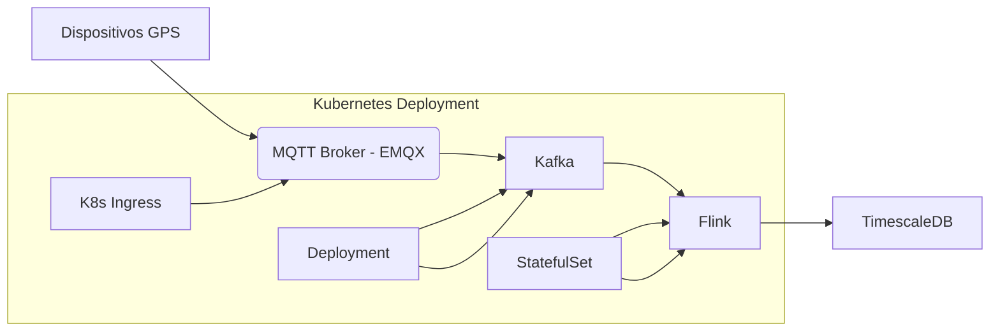

# Despliegue con Contenedores (Docker) y Orquestación (Kubernetes)

Este diseño cubre la containerización de los componentes del sistema AVL y su despliegue escalable en Kubernetes, garantizando alta disponibilidad y eficiencia en el manejo de hasta 500k dispositivos GPS.

## 1. Containerización con Docker

### 1.1 Estructura de Imágenes Docker

| Componente          | Imagen Docker                     | Configuración Recomendada                     |
|---------------------|-----------------------------------|-----------------------------------------------|
| **API Gateway**     | `api-gateway:go` (basada en Bitnami) | Multistage build para reducir tamaño          |
| **Procesador GPS**  | `flink-processor:java`             | Heap size ajustado (`-Xmx4G`)                   |
| **Frontend Web**    | `frontend:react (nginx)`            | Optimizada con `npm run build`                |
| **App Móvil (API)** | `mobile-api:go`                     | Variables de entorno para entornos (dev/prod) |
| **MQTT Broker**     | `emqx:5.0`                          | Configuración persistente via volúmenes       |

#### Ejemplo: Dockerfile para Backend (Go)

```dockerfile
# Build stage
FROM golang:1.21 as builder
WORKDIR /app
COPY go.mod go.sum ./
RUN go mod download
COPY . .
RUN CGO_ENABLED=0 GOOS=linux go build -o /api-gateway

# Runtime stage
FROM alpine:3.18
WORKDIR /app
COPY --from=builder /api-gateway .
COPY config.yaml .
EXPOSE 8080
CMD ["./api-gateway"]
```
#### Ejemplo: Dockerfile para Frontend (React)

```dockerfile
FROM node:18 as builder
WORKDIR /app
COPY package*.json ./
RUN npm install
COPY . .
RUN npm run build

FROM nginx:alpine
COPY --from=builder /app/build /usr/share/nginx/html
COPY nginx.conf /etc/nginx/conf.d/default.conf
EXPOSE 80
```
## 2. Orquestación con Kubernetes
### 2.1 Arquitectura del Cluster

* Nodos:

    * Nodos de CPU: Para microservicios (Go, Flink).

    * Nodos de GPU (opcional): Si se usa ML para detección de anomalías.

* Red:

    * Calico para políticas de red (aislamiento de pods).

    * Ingress Nginx para rutas públicas (API y frontend).

### 2.2 Archivos de Configuración Kubernetes

#### Ejemplo: Deployment para API Gateway (Go)

```yaml
apiVersion: apps/v1
kind: Deployment
metadata:
  name: api-gateway
spec:
  replicas: 3
  selector:
    matchLabels:
      app: api-gateway
  template:
    metadata:
      labels:
        app: api-gateway
    spec:
      containers:
      - name: api-gateway
        image: registry.example.com/api-gateway:1.0.0
        ports:
        - containerPort: 8080
        env:
        - name: DB_URL
          valueFrom:
            secretKeyRef:
              name: db-secrets
              key: url
        resources:
          limits:
            cpu: "1"
            memory: "512Mi"
      nodeSelector:
        node-type: cpu-optimized
```

#### Ejemplo: Service para MQTT Broker (EMQX)

```yaml
apiVersion: v1
kind: Service
metadata:
  name: mqtt-broker
spec:
  type: LoadBalancer
  ports:
  - name: mqtt
    port: 1883
    targetPort: 1883
  - name: mqtts
    port: 8883
    targetPort: 8883
  selector:
    app: emqx
```

#### Ejemplo: Horizontal Pod Autoscaler (HPA) para Procesador Flink

```yaml
apiVersion: autoscaling/v2
kind: HorizontalPodAutoscaler
metadata:
  name: flink-processor
spec:
  scaleTargetRef:
    apiVersion: apps/v1
    kind: Deployment
    name: flink-processor
  minReplicas: 2
  maxReplicas: 10
  metrics:
  - type: Resource
    resource:
      name: cpu
      target:
        type: Utilization
        averageUtilization: 70
```

## 3. Configuración de Almacenamiento Persistente

### 3.1 Volúmenes para Kafka y PostgreSQL

```yaml
# Persistent Volume Claim para Kafka
apiVersion: v1
kind: PersistentVolumeClaim
metadata:
  name: kafka-data
spec:
  accessModes:
    - ReadWriteOnce
  resources:
    requests:
      storage: 100Gi
  storageClassName: gp3
```

### 3.2 StatefulSet para PostgreSQL con TimescaleDB

```yaml
apiVersion: apps/v1
kind: StatefulSet
metadata:
  name: timescaledb
spec:
  serviceName: "timescaledb"
  replicas: 1
  selector:
    matchLabels:
      app: timescaledb
  template:
    metadata:
      labels:
        app: timescaledb
    spec:
      containers:
      - name: timescaledb
        image: timescale/timescaledb:latest-pg15
        ports:
        - containerPort: 5432
        volumeMounts:
        - name: pgdata
          mountPath: /var/lib/postgresql/data
  volumeClaimTemplates:
  - metadata:
      name: pgdata
    spec:
      accessModes: [ "ReadWriteOnce" ]
      resources:
        requests:
          storage: 200Gi
```

4. Mecanismos de Alta Disponibilidad
4.1 Distribución Multi-AZ

    Kafka:

        3 brokers en distintas zonas (usando affinity para evitar colocar pods en la misma AZ).

    PostgreSQL:

        Réplicas de lectura en otras AZs (configuradas via pgpool-II).

4.2 Recuperación ante Desastres

    Backups automatizados:

        PostgreSQL: WAL-G + S3 (ej: wal-g backup-push /var/lib/postgresql/data).

        Kafka: MirrorMaker a otro cluster en región secundaria.

    Restauración:

        Scripts de recuperación en un Job de Kubernetes (ej: wal-g backup-fetch).

5. Monitoreo y Logging
5.1 Stack Prometheus + Grafana

    Configuración para Go (Prometheus metrics):

```go
import "github.com/prometheus/client_golang/prometheus"
http.Handle("/metrics", promhttp.Handler())
```

Dashboard de Grafana:

    Métricas clave: Latencia de API, tasa de mensajes MQTT, uso de CPU/memoria por pod.

5.2 Logging con ELK

    Fluentd como DaemonSet:

```yaml
apiVersion: apps/v1
kind: DaemonSet
metadata:
  name: fluentd
spec:
  template:
    spec:
      containers:
      - name: fluentd
        image: fluent/fluentd-kubernetes-daemonset:v1.16
        env:
        - name: FLUENT_ELASTICSEARCH_HOST
          value: "elasticsearch.logging.svc.cluster.local"
```

6. CI/CD con GitOps (FluxCD o ArgoCD)
6.1 Pipeline Ejemplo (GitHub Actions)

```yaml
name: Deploy to Kubernetes
on:
  push:
    branches:
      - main
jobs:
  deploy:
    runs-on: ubuntu-latest
    steps:
    - uses: actions/checkout@v3
    - name: Build and Push Docker Image
      run: |
        docker build -t registry.example.com/api-gateway:$GITHUB_SHA .
        echo ${{ secrets.DOCKER_PASSWORD }} | docker login -u ${{ secrets.DOCKER_USERNAME }} --password-stdin
        docker push registry.example.com/api-gateway:$GITHUB_SHA
    - name: Deploy to Kubernetes
      run: |
        kubectl set image deployment/api-gateway api-gateway=registry.example.com/api-gateway:$GITHUB_SHA
```

Conclusión

Este diseño garantiza:
* ✅ Escalabilidad horizontal para manejar 50k → 500k dispositivos.
* ✅ Alta disponibilidad con multi-AZ y auto-reparación (K8s self-healing).
* ✅ Eficiencia de recursos (HPA, nodos heterogéneos).
* ✅ Recuperación ante desastres automatizada.


Diagrama de despliegue

