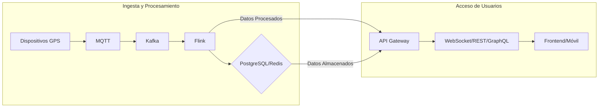

## 1. Manejo de APIs (REST/GraphQL)

### 1.1 Arquitectura de APIs

| Tipo      | Uso                                                                 | Tecnología               | Justificación                                                                 |
|-----------|---------------------------------------------------------------------|--------------------------|-------------------------------------------------------------------------------|
| **REST**  | - CRUD de dispositivos/users<br>- Configuración                    | Go (Gin/Fiber)           | Simplicidad, cacheabilidad (HTTP/2)                                          |
| **GraphQL** | - Consultas complejas<br>(ej: "Dame todos los dispositivos en NY con velocidad > 80km/h") | Apollo Server (Go) | Flexibilidad para frontend/móvil                                             |
| **gRPC**  | - Comunicación entre microservicios<br>(ej: geolocalización → alertas) | Protocol Buffers         | Baja latencia, ideal para internals                                           |

#### Ejemplo: API REST en Go (Gin)

```go
package main

import (
	"github.com/gin-gonic/gin"
)

func main() {
	r := gin.Default()
	r.GET("/devices/:id/location", func(c *gin.Context) {
		id := c.Param("id")
		location := getLocationFromDB(id) // Ej: TimescaleDB
		c.JSON(200, gin.H{"location": location})
	})
	r.Run(":8080")
}
```

#### Ejemplo: API GraphQL (Apollo Server en Go)

```go
package main

import (
	"github.com/graphql-go/graphql"
	"github.com/graphql-go/handler"
)

var queryType = graphql.NewObject({
	Name: "Query",
	Fields: graphql.Fields{
		"devicesNearby": &graphql.Field{
			Type: graphql.NewList(deviceType),
			Args: graphql.FieldConfigArgument{
				"lat":  &graphql.ArgumentConfig{Type: graphql.Float},
				"long": &graphql.ArgumentConfig{Type: graphql.Float},
				"radius": &graphql.ArgumentConfig{Type: graphql.Float},
			},
			Resolve: func(p graphql.ResolveParams) (interface{}, error) {
				// Consulta a PostgreSQL con PostGIS
				return getDevicesInRadius(p.Args["lat"], p.Args["long"], p.Args["radius"])
			},
		},
	},
})

func main() {
	schema, _ := graphql.NewSchema(graphql.SchemaConfig{Query: queryType})
	h := handler.New(&handler.Config{Schema: &schema})
	http.Handle("/graphql", h)
	http.ListenAndServe(":8080", nil)
}
```

### 1.2 Optimizaciones Clave

    Caché: Redis para respuestas frecuentes (ej: últimas ubicaciones).

    Rate Limiting: Kong/Traefik para evitar abuso (100 req/s por dispositivo).

    Documentación Automática:

        REST: Swagger (usando swaggo).

        GraphQL: Apollo Studio o Playground.

## 2. Integración de Mapas/Geolocalización en Tiempo Real

### 2.1 Stack para Mapas

| Capa          | Tecnología                     | Ventajas                                                                 |
|---------------|--------------------------------|--------------------------------------------------------------------------|
| **Frontend Web** | React + Mapbox GL JS / Leaflet | - Renderizado GPU<br>- Soporte para 100k+ markers                        |
| **Mobile**      | React Native + Mapbox GL Native | - Mismo rendimiento que nativo<br>- Offline maps                         |
| **Backend**     | PostGIS (PostgreSQL)           | - Consultas geoespaciales (ej: "Dispositivos en un radio de 5km")       |

## 2.2 Flujo de Datos en Tiempo Real

* Dispositivo GPS → MQTT → Kafka → Flink (procesa) → PostgreSQL/Redis.

* Frontend/App consulta API REST/GraphQL o se suscribe via WebSocket para updates.

#### Ejemplo: WebSocket con Go (Gorillas/WebSocket)

```go
func handleConn(w http.ResponseWriter, r *http.Request) {
	conn, _ := websocket.Upgrade(w, r, nil, 1024, 1024)
	for {
		// Envía ubicaciones cada 1s desde Redis
		locations := redisClient.Get("last_locations")
		conn.WriteJSON(locations)
		time.Sleep(1 * time.Second)
	}
}
```

#### Ejemplo: Visualización en React (Mapbox GL JS)

```jsx
import React, { useEffect, useRef } from 'react';
import mapboxgl from 'mapbox-gl';

function Map() {
	const mapRef = useRef(null);
	useEffect(() => {
		const map = new mapboxgl.Map({
			container: mapRef.current,
			style: 'mapbox://styles/mapbox/streets-v11',
			center: [-74.5, 40],
			zoom: 9
		});

		// Conexión WebSocket para updates en vivo
		const ws = new WebSocket('wss://api.example.com/ws');
		ws.onmessage = (e) => {
			const devices = JSON.parse(e.data);
			devices.forEach(device => {
				new mapboxgl.Marker().setLngLat(device.location).addTo(map);
			});
		};
	}, []);

	return <div ref={mapRef} style={{ width: '100%', height: '500px' }} />;
}
```

### 2.3 Optimizaciones para Mapas

* Clustering: Agrupa markers cercanos para mejorar rendimiento (usando supercluster).

* Tile Server (Opcional): Si se requieren mapas personalizados (ej: tegola + OpenStreetMap).

* Offline Mode (Mobile): Cache de mapas via react-native-mapbox-gl-offline.

## 3. Comparativa: REST vs GraphQL para Geolocalización

| Criterio      | REST                              | GraphQL                            |
|--------------|-----------------------------------|------------------------------------|
| **Latencia** | Más rápido en consultas simples   | Ideal para queries complejas (1 request) |
| **Flexibilidad** | Over-fetching en algunos casos | El cliente elige los campos        |
| **Caché**    | Fácil (HTTP caching)             | Requiere soluciones como Apollo Cache |

#### Recomendación:

* Usar REST para:

    *  CRUD de dispositivos.

    * Configuración (low-frequency).

* Usar GraphQL para:

    * Dashboards con filtros complejos.

    * Móvil (evitar múltiples llamadas).

## 4. Seguridad en APIs y Mapas

* Autenticación:

    * JWT para usuarios.

    * Certificados TLS client-side para dispositivos GPS.

* Protección de Mapas:

    * Token de acceso (Mapbox).

    * Limitar peticiones por IP (rate limiting).

## 5. Conclusión

* APIs: Combinación óptima de REST (simplicidad) + GraphQL (flexibilidad) + gRPC (performance interna).

* Mapas:

    * Web: Mapbox GL JS para alta interactividad.

    * Mobile: Mapbox GL Native + WebSocket para updates en tiempo real.

* Backend: PostGIS + Redis como columna vertebral geoespacial.

#### Diagrama de Flujo:




[__Anterior__ Despliegue en contenedores](/docs/despliegue-en-contenedores.md)

[__Siguente__ Infrastraestructura](/docs/infraestructura.md)