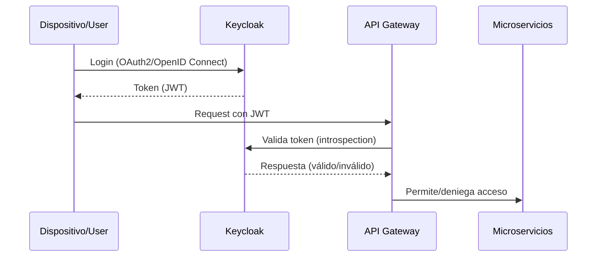
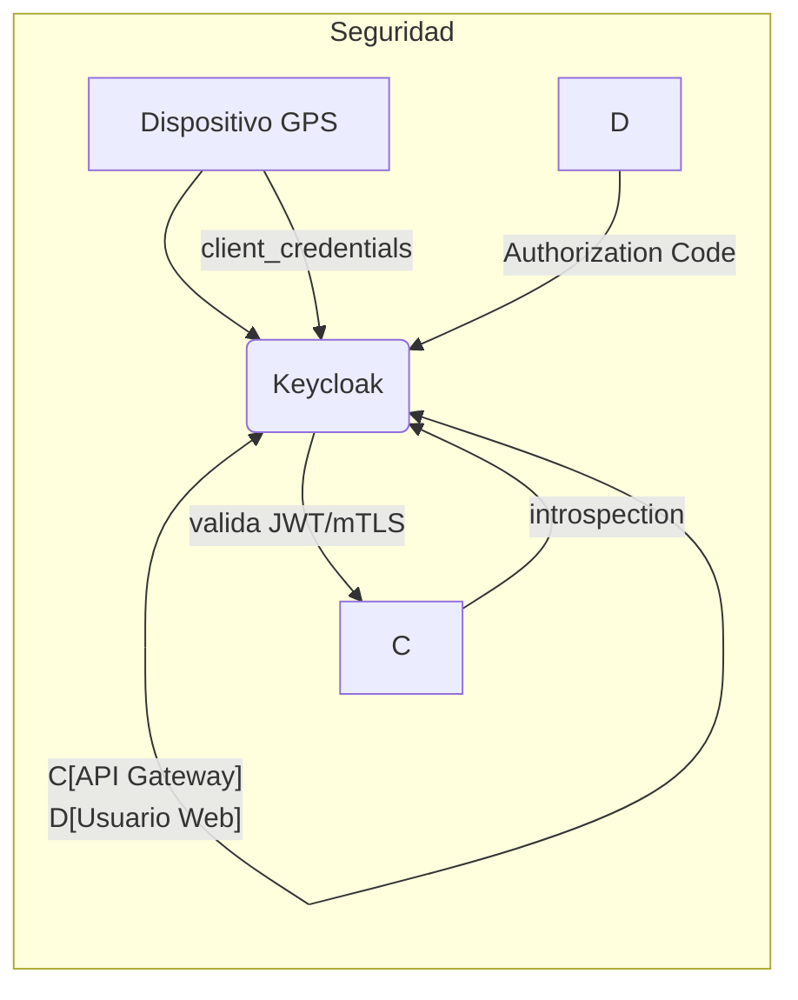

# Seguridad y Autenticación con Keycloak en el Sistema AVL

Keycloak es una solución integral de gestión de identidad y acceso (IAM) que ofrece:

    Seguridad robusta - Protege datos sensibles mediante protocolos estándar (OAuth 2.0, OpenID Connect)

    Autenticación centralizada - Separa completamente:

        La capa de autenticación

        La infraestructura técnica

        La lógica de negocio

Beneficios clave:
✓ Desacoplamiento seguro de componentes
✓ Implementación sin impactar el sistema existente
✓ Reducción de vulnerabilidades al externalizar la seguridad
✓ Soporte para múltiples protocolos y proveedores de identidad

Caso de uso ideal: Sistemas distribuidos como plataformas AVL que requieren autenticación escalable para dispositivos IoT, usuarios y APIs.

En el sistema AVL, se usará para:

* Autenticar usuarios (web/móvil) y dispositivos GPS.

* Gestionar roles (admin, flota, dispositivo).

* Proteger APIs (REST/GraphQL) y brokers MQTT.


1. Arquitectura de Keycloak
1.1 Componentes

| Elemento               | Función                                          | Configuración                              |
|------------------------|-------------------------------------------------|--------------------------------------------|
| **Realm**             | Entorno separado para el sistema AVL.          | avl-realm (con políticas personalizadas). |
| **Clientes**          | Apps que usan Keycloak: Web, Móvil, API.       | avl-web, avl-mobile, avl-api.             |
| **Roles**             | Define permisos: admin, fleet, device.         | Jerarquía de roles (ej: admin > fleet).   |
| **Identity Providers**| Conexión con LDAP/Active Directory (opcional). | Sync de usuarios empresariales.           |

1.2 Flujo de Autenticación



2. Configuración para Dispositivos GPS y Usuarios
2.1 Autenticación de Dispositivos GPS

    Método:

        Client Credentials Grant (OAuth2): Cada dispositivo tiene un client_id y client_secret.

        Certificados TLS (mTLS): Para mayor seguridad en MQTT.

Ejemplo: Registro de Dispositivo en Keycloak

```bash
# Crear cliente en Keycloak para dispositivos
kcadm.sh create clients -r avl-realm -s clientId=gps-device -s enabled=true -s publicClient=false -s secret="*****" -s protocol=openid-connect
```

2.2 Autenticación de Usuarios (Web/Móvil)

    Métodos:

        Authorization Code Flow (para web).

        PKCE (para móvil, evita ataques de interceptación).

Ejemplo: Configuración en Keycloak

```bash
# Crear cliente para la app web
kcadm.sh create clients -r avl-realm -s clientId=avl-web -s redirectUris=["https://app.avl.com/*"] -s publicClient=true
```

3. Integración con el Stack Tecnológico
3.1 Backend (Go)

    Middleware de validación JWT:

```go
func AuthMiddleware(c *gin.Context) {
    token := c.GetHeader("Authorization")
    // Validar con Keycloak via introspection endpoint
    resp, err := http.Post("https://keycloak.example.com/auth/realms/avl-realm/protocol/openid-connect/token/introspect", "...")
    if err != nil || !resp.IsValid {
        c.AbortWithStatus(401)
    }
}
```
3.2 Frontend (React)

Login con Keycloak JS:

```jsx
import { Keycloak } from '@keycloak/keycloak-js';
const keycloak = new Keycloak({ url: 'https://keycloak.example.com', realm: 'avl-realm', clientId: 'avl-web' });
keycloak.init({ onLoad: 'login-required' }).then(authenticated => { if (authenticated) loadApp(); });
```

3.3 MQTT Broker (EMQX)

    Autenticación con JWT:

```bash
# Configuración en EMQX
authentication.jwt.secret = https://keycloak.example.com/auth/realms/avl-realm/protocol/openid-connect/certs
authentication.jwt.from = password
```

4. Seguridad Avanzada
4.1 Protección de APIs

    Políticas de Acceso:

        Los dispositivos solo pueden publicar en topics MQTT específicos (ej: gps/{device_id}).

        Los usuarios fleet solo pueden leer datos de sus flotas asociadas.

Ejemplo: Policy en Keycloak

```json
{
  "type": "js",
  "logic": "POSITIVE",
  "decisionStrategy": "UNANIMOUS",
  "config": {
    "code": "// Permite acceso solo si el device_id en el token coincide con el topic MQTT
      if (context.attributes.topic.startsWith('gps/' + token.device_id)) { $grant(); }"
  }
}
```

4.2 Hardening de Keycloak

    Configuraciones Recomendadas:

        SSL/TLS: Forzar HTTPS.

        Brute-Force Protection: Límite de intentos fallidos.

        Session Timeout: 30 minutos de inactividad.

5. Recuperación ante Desastres

    Backup Automatizado:

        Exportación diaria del realm (kcadm.sh get realms/avl-realm -o backup.json).

        Replicación en región secundaria (Keycloak en cluster HA).

    Failover:

        DNS failover (Route 53) a instancia secundaria.

6. Monitoreo

    Métricas Clave:

        Intentos fallidos de login (alertar si >100/hora).

        Tiempo de respuesta de Keycloak (<500ms).

    Herramientas:

        Prometheus + Grafana (exporter de Keycloak).

        ELK para logs de auditoría.

Conclusión

Keycloak proporciona:
✅ Autenticación centralizada para usuarios y dispositivos.
✅ Autorización granular con roles/políticas.
✅ Integración estándar (OpenID Connect, OAuth2).
✅ Alta disponibilidad con clustering y backups.


Diagrama de Securidad:


